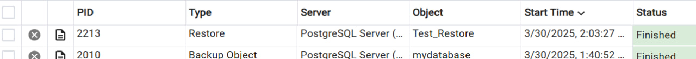

# DBProject

# דוח פרויקט - ניהול מערכת בסיסי נתונים של אוניברסיטאות - המחלקה הפיננסית

## שער

- שמות המגישים: עמית מורדוב , ינון שאול
- המערכת הנבחרת: מערכת לניהול אוניברסיטאות
- היחידה הנבחרת: המחלקה הפיננסית

## תוכן עניינים

1. [מבוא](#מבוא)
2. [תרשימי ERD ו-DSD](#תרשימי-ERD-ו-DSD)
3. [תיאור מבני הנתונים](#תיאור-מבני-הנתונים)
4. [שיטות הכנסת הנתונים](#שיטות-הכנסת-הנתונים)
5. [גיבוי ושחזור נתונים](#גיבוי-ושחזור-נתונים)
6. [סיכום](#סיכום)

## מבוא

המערכת שתוכננה היא מערכת לניהול בסיסי נתונים של אוניברסיטאות, עם דגש על המחלקה הפיננסית. במערכת זו נשמרים נתונים שונים אודות מחלקות, עובדים, תקציבים, סטודנטים, תשלומים, מלגות, סיוע כלכלי ועוד.

המטרה של המערכת היא לספק אפשרות לניהול יעיל ומסודר של הנתונים השונים, תוך שימוש בקשרים בין הטבלאות באמצעות מפתחות זרים , ישות חלשה וכו'.

### עיצוב המערכת

העיצוב של בסיס הנתונים כלל החלטות לגבי שימוש במפתחות זרים על מנת להבטיח תקינות נתונים ולהקטין כפילויות. לדוגמה, כל עובד משתייך למחלקה מסוימת, וכל סטודנט יכול לבצע תשלומים או לקבל מלגות וסיוע כלכלי . 
דוגמא נוספת : ישנה ישות חלשה בשם Payment הקשורה לטבלה Student , ומתקיים כי אין תשלום לאוניברסיטה ללא סטודנט הנדרש לשלמה . 

## תרשים ERD

## תרשים DSD

## תיאור מבני הנתונים

The following tables were created as part of the system:
• Department: Represents a department within the university.
• Employees: Represents an employee within the university.
• Budget: Represents the university's annual budget.
• uses_budget: An entity connecting departments and budgets.
• Student: Represents a student.
• Payment: Represents a payment made by a student.
• Scholarship: Represents a scholarship granted to a student.
• takes_scholarship: An entity connecting scholarships to students.
• Financial_Aid: Represents financial aid given to a student.
• receives_aid: An entity connecting students to financial aid.

Details of departments

Employees
Represents an employee within the university. Includes:
• employee_id: Unique identifier of the employee.
• name: Employee's name.
• salary: Employee's salary.
• hire_date: Date of employment.
• department_id: Department identifier to which the employee is associated (Foreign key).
Budget
Represents the university's annual budget. Includes:
• budget_id: Unique identifier of the budget.
• total_amount: Total amount of the budget.
• budget_year: The year of the budget.
uses_budget
An entity connecting departments and budgets. Includes:
• department_id: Department identifier (Foreign key).
• budget_id: Budget identifier (Foreign key).
Student
Represents a student. Includes:
• StudentID: Unique identifier of the student.
• FirstName: First name.
• LastName: Last name.
• Email: Email address.
Payment (Weak Entity)
Represents a payment made by a student. Includes:
• payment_id: Unique identifier of the payment.
• StudentID: Identifier of the student making the payment (Foreign key).
• amount: Payment amount.
• payment_date: Date of the payment.
• type_payment: Type of payment (e.g., Tuition).
• topic: Payment topic (if applicable).
Scholarship
Represents a scholarship granted to a student. Includes:
• scholarship_id: Unique identifier of the scholarship.
• Name: Scholarship name.
• Amount: Scholarship amount.
• AnnualHours: Annual hours required to maintain the scholarship.
takes_scholarship
An entity connecting scholarships to students. Includes:
• scholarship_id: Scholarship identifier (Foreign key).
• StudentID: Student identifier (Foreign key).
• approval_date: Date of approval.
Financial_Aid
Represents financial aid given to a student. Includes:
• aid_id: Unique identifier of the financial aid.
• aid_type: Type of aid (e.g., Grant or Loan).
• aid_amount: Amount of aid.
• approval_date: Date of approval.
• repayment_due: Due date for repayment (if applicable).
receives_aid
An entity connecting students to financial aid. Includes:
• StudentID: Student identifier (Foreign key).
• aid_id: Aid identifier (Foreign key).
• application_date: Date of application.

💾 **קובץ יצירת הטבלאות מצורף גם הוא בתיקייה שלב א.**

## שיטות הכנסת הנתונים

## שיטה א - סקריפט בפייתון

## שיטה ב -  mockaroo

## שיטה ג - generatedata

## גיבוי ושחזור נתונים

## סיכום

המערכת שתוכננה מאפשרת ניהול מסודר של הנתונים הנדרשים, תוך שימוש בקשרים בין טבלאות באמצעות מפתחות זרים והגדרות מתאימות. העבודה כללה יצירת טבלאות, עיצוב קשרים, והכנסת נתונים בצורה מסודרת.

תרשימי ERD ו-DSD וכן צילומי מסך של תהליכי הכנסת הנתונים, גיבוי ושחזור.

הנושא הגדול הוא אוניברסיטאות , והמחלקה שלנו בפרוייקט זה הנושא הפיננסי . 
