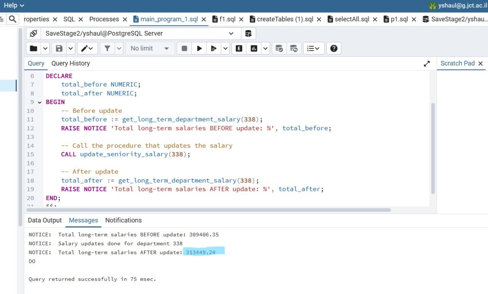
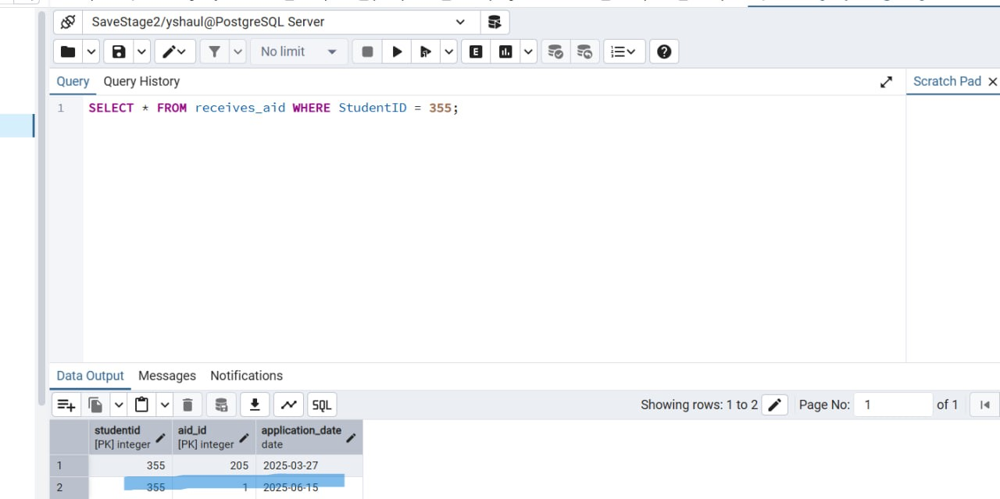

# DBProject - University Financial Department Database System


---


<br>
<br>
<br>

## 📘 Project Report 

This project is a university financial department database management system. It was developed as part of a database course project.

### 🧑‍💻 Authors
- Amit Mordov  
- Yinon Shaul

### 🏢 Project Scope
- **System**: University Management System  
- **Unit**: Financial Department  

---

## 📌 Table of Contents

1. [Overview](#overview)
2. [ERD and DSD Diagrams](#erd-and-dsd-diagrams)
3. [Data Structure Description](#data-structure-description)
4. [Data Insertion Methods](#data-insertion-methods)
5. [Backup & Restore](#backup--restore)
6. [Stage 2 – Advanced SQL Queries & Constraints](#stage-2-–-advanced-sql-queries--constraints)

   * [SELECT Queries](#select-queries)
   * [DELETE Queries](#delete-queries)
   * [UPDATE Queries](#update-queries)
   * [Rollback & Commit Transactions](#rollback--commit-transactions)
   * [Constraints Using ALTER TABLE](#constraints-using-alter-table)
7. [Stage 3 – Integration and Views](#stage-3-–-integration-and-views)

   * [ERD and DSD Diagrams (Stage 3)](#erd-and-dsd-diagrams-stage-3)
   * [Integration Decisions](#integration-decisions)
   * [Step-by-Step Integration & Full SQL](#step-by-step-integration--full-sql)
   * [Views after integration](#views-after-integration)
   * [Outcome](#outcome)
8. [Stage 4 – Advanced PL/pgSQL Programs](#stage-4-–-advanced-plpgsql-programs)

   * [Functions](#functions)
   * [Procedures](#procedures)
   * [Triggers](#triggers)
   * [Main Programs](#main-programs)
9. [Stage 5 – Graphical User Interface (GUI) for Database Interaction](#stage-5-–-graphical-user-interface-gui-for-database-interaction)

   * [db](#db)
   * [login\_screen](#login_screen)
   * [main](#main)
   * [student\_crud](#student_crud)
   * [payment\_crud](#payment_crud)
   * [takes\_scholarship\_crud](#takes_scholarship_crud)
   * [fetch\_all\_tables](#fetch_all_tables)
   * [more\_option](#more_option)
   * [queries\_screen](#queries_screen)
   * [functions\_screen](#functions_screen)
   * [procedures\_screen](#procedures_screen)
   * [main\_programs\_screen](#main_programs_screen)
10. [Conclusion](#conclusion)

## 🧾 Overview

This database system is designed to manage the financial operations of a university. It includes data about departments, employees, budgets, students, payments, scholarships, and financial aid.

The system uses foreign keys, weak entities, and entity relationships to maintain data consistency and avoid redundancy.

---

## 🗂️ ERD and DSD Diagrams

### ERD


### DSD


---

## 🗃️ Data Structure Description

> Below is a summary of the main entities and their fields:

### Department  
Represents a university department.
- `department_id` (Primary key)
- `name`
- `description`

### Employees  
- `employee_id`  (Primary key)
- `name`  
- `salary`  
- `hire_date`  
- `department_id` (Foreign Key)

### Budget  
- `budget_id`     (Primary key)
- `total_amount`  
- `budget_year`

### uses_budget  
Links budgets to departments.  
- `department_id` (Foreign Key)  
- `budget_id` (Foreign Key)

### Student  
- `StudentID`   (Primary key)
- `FirstName`
- `LastName`,
- `Email`

### Payment *(Weak Entity)*  
- `payment_id`  (Primary key) 
- `StudentID` (Foreign Key)  
- `amount`
- `payment_date`
- `type_payment`
- `topic`

### Scholarship  
- `scholarship_id`   (Primary key)
- `Name`
- `Amount`
- `AnnualHours`

### takes_scholarship  
- `scholarship_id` (Foreign Key)  
- `StudentID` (Foreign Key)  
- `approval_date`

### Financial_Aid  
- `aid_id`    (Primary key)
- `aid_type`
- `aid_amount`
- `approval_date`
- `repayment_due`

### receives_aid  
- `StudentID` (Foreign Key)  
- `aid_id` (Foreign Key)  
- `application_date`

📄 SQL table creation scripts are included in the `Stage1` folder.

---

## 📥 Data Insertion Methods

### ✅ Method A: Python Script  


### ✅ Method B: Mockaroo Generator  


### ✅ Method C: Generatedata  


---

## 💾 Backup & Restore

### Backup  


### Restore  


---

<br><br>

# 📘 Stage 2 – Advanced SQL Queries & Constraints

This section includes documentation and screenshots for advanced SQL queries (SELECT, DELETE, UPDATE) and constraint handling as required in Stage 2.

---

## 📊 SELECT Queries

> A total of 8 SELECT queries were implemented. Each query is described and accompanied by screenshots.

### 🔍 SELECT 1: Total payments per student per year

📘 **Background**: A student once requested a refund, claiming they paid twice. Investigation revealed the finance office lacked a clear annual payment summary per student.  
✅ **Benefit**: This report helps the finance department track student income, detect anomalies or duplicates, and give accurate responses to student inquiries.


### 🔍 SELECT 2: Monthly income summary from payments

📘 **Background**: As the quarter ended, the university's management requested a summarized monthly income report to monitor cash flow.  
✅ **Benefit**: Enables budget planning and helps evaluate financial stability month by month.


### 🔍 SELECT 3: Payments in the last month

📘 **Background**: A new online payment system was launched. The administration wanted to assess how many students actually used it in the last month.  
✅ **Benefit**: Tracks adoption of the new platform and allows real-time financial activity monitoring.


### 🔍 SELECT 4: Departments with total budgets over 50,000

📘 **Background**: A department complained of unequal funding. The administration needed a clear comparison of budgets between departments.  
✅ **Benefit**: Helps identify well-funded departments and supports a fair reallocation of resources.


### 🔍 SELECT 5: Employees by hire year and department

📘 **Background**: HR wanted insights into which departments had large hiring waves and in which years.  
✅ **Benefit**: Supports workforce planning and helps predict future hiring needs.


### 🔍 SELECT 6: Average payment amount by type

📘 **Background**: The finance office wanted to compare types of student payments — for example, course fees vs. administrative charges.  
✅ **Benefit**: Helps assess pricing strategy and reveals key income sources.


### 🔍 SELECT 7: Students receiving aid but no scholarship

📘 **Background**: Aid requests were rising. The administration wanted to identify students receiving financial aid who might also qualify for scholarships but hadn't applied.  
✅ **Benefit**: Allows targeted outreach and better scholarship utilization to reduce aid dependency.


### 🔍 SELECT 8: Highest scholarship granted per year

📘 **Background**: The student newspaper requested information about the highest awarded scholarships per year.  
✅ **Benefit**: Promotes transparency and encourages students to apply for high-value scholarships.


---

<br>

## 🗑️ DELETE Queries

### ❌ DELETE 1: Remove old small payments

📘 **Background**: During database backup, it was discovered that the Payment table held outdated and low-value data no longer needed.  
✅ **Benefit**: Cleaning old data improves performance and reduces storage overhead.

```sql
DELETE FROM Payment
WHERE payment_date < CURRENT_DATE - INTERVAL '2 years'
  AND amount < (
      SELECT AVG(p2.amount)
      FROM Payment p2
      WHERE p2.type_payment = Payment.type_payment
  );
```


### ❌ DELETE 2: Delete employees with salary between 70,000 and 90,000

📘 **Background**: An internal audit flagged a suspicious salary range (70k–90k) for employees with unclear roles.  
✅ **Benefit**: Quickly removes potentially fraudulent or incorrect employee entries during a cleanup phase.

```sql
DELETE FROM Employees
WHERE salary between 70000 and 90000;
```


### ❌ DELETE 3: Delete scholarships with low hour requirements

📘 **Background**: Scholarships with fewer than 90 annual service hours were deemed ineffective in terms of student contribution.  
✅ **Benefit**: Ensures every scholarship involves a minimum amount of community service and provides better impact.

```sql
ALTER TABLE takes_scholarship
DROP CONSTRAINT takes_scholarship_scholarship_id_fkey,
ADD CONSTRAINT takes_scholarship_scholarship_id_fkey
FOREIGN KEY (scholarship_id) REFERENCES Scholarship(scholarship_id) ON DELETE CASCADE;

DELETE FROM Scholarship
WHERE AnnualHours < 90;
```


---

<br>

## 🔄 UPDATE Queries

### ✏️ UPDATE 1: Reduce salary by 80% in low-budget departments

📘 **Background**: Budget cuts were applied in several departments. Instead of layoffs, the university opted to reduce salaries in underfunded departments.  
✅ **Benefit**: Maintains employment while staying within budgetary limits.

```sql
UPDATE Employees
SET salary = salary * 0.2
WHERE department_id IN (
    SELECT ub.department_id
    FROM uses_budget ub
    JOIN Budget b ON ub.budget_id = b.budget_id
    GROUP BY ub.department_id
    HAVING SUM(b.total_amount) < 100000
);
```


### ✏️ UPDATE 2: Raise scholarship by 10% if payment average is higher

📘 **Background**: Students receiving scholarships were still paying more than their awarded amount on average.  
✅ **Benefit**: Ensures scholarship values are adjusted to match actual educational expenses, promoting equity.

```sql
UPDATE Scholarship
SET Amount = CASE
    WHEN (SELECT AVG(p.amount)
          FROM Payment p
          JOIN takes_scholarship ts ON p.StudentID = ts.StudentID
          WHERE ts.scholarship_id = Scholarship.scholarship_id) > Scholarship.Amount
    THEN Scholarship.Amount * 1.1
    ELSE Scholarship.Amount
END;
```


### ✏️ UPDATE 3: Add prefix "israel-" before email @ sign

📘 **Background**: Due to integration with a new government verification system, all student emails had to include the "israel-" prefix before the @ symbol.  
✅ **Benefit**: Ensures email addresses conform to new national digital ID systems.

```sql
UPDATE Student
SET Email = SUBSTRING(Email, 1, POSITION('@' IN Email) - 1) || 'israel-' || SUBSTRING(Email, POSITION('@' IN Email), LENGTH(Email))
WHERE Email NOT LIKE '%israel-%';
```


---

<br>

## 🔄 Rollback & Commit Transactions

### 🔙 Rollback Transaction

📘 **Background**: Due to a recent cyberattack on Israel's national systems, all updates involving sensitive data were temporarily suspended. As part of this response, the decision was made to rollback any changes to student email addresses, including the modification that was intended to prepend "israel-" to student emails.  
✅ **Benefit**: This ensures that no unintended changes were made to critical contact information, maintaining the integrity and security of the university's student database.

```sql
-- Start of rollback transaction
BEGIN;

-- Perform the update (add 'israel-' before '@' in emails)
UPDATE Student
SET Email = SUBSTRING(Email, 1, POSITION('@' IN Email) - 1) || 'israel-' || SUBSTRING(Email, POSITION('@' IN Email), LENGTH(Email))
WHERE Email NOT LIKE '%israel-%';

-- Check current state after update (before rollback)
SELECT StudentID, Email FROM Student WHERE Email LIKE '%israel-%';

-- Rollback the transaction to undo the update
ROLLBACK;

-- Check state again to confirm emails returned to original form
SELECT StudentID, Email FROM Student WHERE Email NOT LIKE '%israel-%';
```


### ✅ Commit Transaction

📘 **Background**: In celebration of Israel's 77th Independence Day, the government has decided that for students receiving scholarships, if their required volunteer hours are exactly 77, an additional 77 NIS will be added to their scholarship amount.  
✅ **Benefit**: This update ensures that students who meet this specific criteria are rewarded appropriately, aligning the university's scholarship policies with the national initiative.

```sql
-- Start of commit transaction
BEGIN;

-- Update: Add 77 NIS to the Amount of scholarships with exactly 77 AnnualHours
UPDATE Scholarship
SET Amount = Amount + 77
WHERE AnnualHours = 77;

-- Preview: See the scholarships that were updated BEFORE committing
SELECT scholarship_id, Name, Amount, AnnualHours
FROM Scholarship
WHERE AnnualHours = 77;

-- Finalize the update
COMMIT;

-- Confirm the changes AFTER committing
SELECT scholarship_id, Name, Amount, AnnualHours
FROM Scholarship
WHERE AnnualHours = 77;
```


---

## 🔧 Constraints Using ALTER TABLE

### 🔧 Constraint 1: CHECK constraint on positive salary
```sql
ALTER TABLE Employees
ADD CONSTRAINT positive_salary CHECK (salary > 0);
```


### 🔧 Constraint 2: DEFAULT value for scholarship amount
```sql
ALTER TABLE Scholarship
ALTER COLUMN Amount SET DEFAULT 1000.00;
```


### 🔧 Constraint 3: NOT NULL for student first name
```sql
ALTER TABLE Student
ALTER COLUMN FirstName SET NOT NULL;
```


---


# 🔗 Stage 3 – Integration and Views

📜This stage focuses on integrating the Financial Department database with the Dormitory Management database — a crucial component of the overall university management system. The objective is to build a unified structure that enables a comprehensive view of student-related information, combining both financial and residential data.
As part of this integration, SQL views were created from both the perspective of our department and the collaborating department. These views provide streamlined, role-specific access to the combined data, making it easier for each side to retrieve and analyze the information most relevant to their operational needs.


## 🗂️ ERD and DSD Diagrams

### ERD (Finansi)


### DSD (Finansi)


### ERD (Dormitory)


### DSD (Dormitory)


### ERD (Integration)


### DSD (Integration)

---

## 🧠 Integration Decisions

- Integration was done using PostgreSQL's `postgres_fdw` foreign data wrapper to allow direct querying of the remote database.
- Remote tables were **mirrored** as foreign tables in the local database, then copied into newly created local tables.
- Student data was merged using a **+400 ID offset** to avoid primary key collisions.
- New columns were added to the `Student` table to accommodate remote attributes like gender, phone, and major.
- Foreign tables were **dropped after integration** for cleanliness and security.

---

## 📝 Integration Process and SQL Commands

> The following key SQL commands were used in the integration process. Each command includes a short explanation of what it does and why it was used.

### 1. Enable the Foreign Data Wrapper

This extension allows PostgreSQL to access tables from another PostgreSQL database.

```sql
CREATE EXTENSION IF NOT EXISTS postgres_fdw;
```

---

### 2. Define the Connection to the Remote Server

This command creates a server definition pointing to the external group project database.

```sql
CREATE SERVER group_db_server
FOREIGN DATA WRAPPER postgres_fdw
OPTIONS (host 'localhost', dbname 'Group_database', port '5432');
```

---

### 3. Create User Mapping for Authentication

This defines how your local user will connect to the remote database (replace credentials as needed).

```sql
CREATE USER MAPPING FOR current_user
SERVER group_db_server
OPTIONS (user '*********', password '*******');
```

---

### 4. Access the Remote Student Table

A foreign table is created that represents the `student` table in the remote database.

```sql
CREATE FOREIGN TABLE student_remote (
    studentid INTEGER,
    firstname VARCHAR(50),
    lastname VARCHAR(50),
    gender gender_type,
    dateofbirth DATE,
    enrollmentdate DATE,
    phonenumber VARCHAR(16),
    email VARCHAR(50),
    major major_type
) SERVER group_db_server
OPTIONS (schema_name 'public', table_name 'student');
```

---

### 5. Modify Local Student Table

Add new columns to support integration with the remote student table.

```sql
ALTER TABLE Student
ADD COLUMN gender gender_type,
ADD COLUMN dateofbirth DATE,
ADD COLUMN enrollmentdate DATE,
ADD COLUMN phonenumber VARCHAR(16),
ADD COLUMN major major_type;
```

You can populate these new fields with dummy/random values using the following logic:

```sql
UPDATE Student
SET
    gender = (CASE WHEN random() < 0.5 THEN 'Male' ELSE 'Female' END)::gender_type_new,
    dateofbirth = CURRENT_DATE - interval '1 year' * (18 + random() * 12),
    enrollmentdate = CURRENT_DATE - interval '1 year' * (random() * 5),
    phonenumber = '+972 ' || lpad(floor(random() * 99)::text, 2, '0') || '-' ||
                  lpad(floor(random() * 999)::text, 3, '0') || '-' ||
                  lpad(floor(random() * 9999)::text, 4, '0'),
    major = (CASE WHEN random() < 0.5 THEN 'Computer Science' ELSE 'Biology' END)::major_type;
```

---

### 6. Integrate Student Data

This inserts remote students into the local `Student` table, offsetting the IDs by 400.

```sql
INSERT INTO Student (StudentID, FirstName, LastName, Email, gender, dateofbirth, enrollmentdate, phonenumber, major)
SELECT studentid + 400, firstname, lastname, email, gender, dateofbirth, enrollmentdate, phonenumber, major
FROM student_remote;
```

---

### 7. Integrate Dormitory Management Tables

This section contains the complete SQL integration script used in Stage 3 of the project, with all commands and comments fully preserved and documented.

---

```sql
-- 1. Create the postgres_fdw extension if it doesn't exist.
--    This extension is required to work with foreign tables in PostgreSQL.
CREATE EXTENSION IF NOT EXISTS postgres_fdw;

-- 2. Create a server object that defines the connection to the remote database.
CREATE SERVER group_db_server
FOREIGN DATA WRAPPER postgres_fdw
OPTIONS (host 'localhost', dbname 'Group_database', port '5432');

-- 3. Create a user mapping to specify the credentials for accessing the remote server.
--    Replace 'yshaul@g.jct.ac.il' and '5TxJQ5zC' with the actual username and password.
--    'current_user' refers to the user executing this command on the local database.
CREATE USER MAPPING FOR current_user
SERVER group_db_server
OPTIONS (user 'yshaul@g.jct.ac.il', password '5TxJQ5zC');

------------------------------------
-- 4. Create a foreign table in the local database that represents the 'student' table in the remote database.
--    This foreign table acts as a local interface to the remote table, enabling data integration.
CREATE FOREIGN TABLE student_remote (
    studentid INTEGER,
    firstname VARCHAR(50),
    lastname VARCHAR(50),
    gender gender_type,
    dateofbirth DATE,
    enrollmentdate DATE,
    phonenumber VARCHAR(16),
    email VARCHAR(50),
    major major_type
) SERVER group_db_server
OPTIONS (schema_name 'public', table_name 'student');

-- Select all data from the foreign table to verify the connection and data retrieval.
SELECT * FROM student_remote;

----------------------------------------------------------------------
-- Alter the existing 'Student' table in the local database to add new columns.
--    These columns are added to facilitate data integration between the 'Student' tables
--    located in both the local and remote databases.
ALTER TABLE Student
ADD COLUMN gender gender_type,
ADD COLUMN dateofbirth DATE,
ADD COLUMN enrollmentdate DATE,
ADD COLUMN phonenumber VARCHAR(16),
ADD COLUMN major major_type;

-- Update the 'Student' table with randomly generated data for the new columns.
--    This assumes you want to populate these columns with some data for testing or initial setup.
--    If you intend to insert specific data from the remote table, the subsequent INSERT statement will handle that.
UPDATE Student
SET
    gender = (CASE WHEN random() < 0.5 THEN 'Male' ELSE 'Female' END)::gender_type_new,
    dateofbirth = CURRENT_DATE - interval '1 year' * (18 + random() * 12),
    enrollmentdate = CURRENT_DATE - interval '1 year' * (random() * 5),
    phonenumber = '+972 ' || lpad(floor(random() * 99)::text, 2, '0') || '-' ||
                  lpad(floor(random() * 999)::text, 3, '0') || '-' ||
                  lpad(floor(random() * 9999)::text, 4, '0'),
    major = (CASE WHEN random() < 0.5 THEN 'Computer Science' ELSE 'Biology' END)::major_type;

-- Select all data from the 'Student' table to view the updated data.
SELECT * FROM Student;


-- Integration note:
-- During the integration phase, the student tables from the remote and local databases are being merged.
-- Decisions are being made to ensure data integrity and prevent overwriting of existing information.
INSERT INTO Student (StudentID, FirstName, LastName, Email, gender, dateofbirth, enrollmentdate, phonenumber, major)
SELECT studentid + 400, firstname, lastname, email, gender, dateofbirth, enrollmentdate, phonenumber, major
FROM student_remote;

-- Select all data from the 'Student' table to view the data after the integration attempt.
SELECT * FROM Student;


-- 5. Creating all tables that do not have a direct relationship, such as FK, to the Student table
-- that is shared by both primary tables, by creating a foreign table, followed by a local table,
--and copying the contents to it

-- 6.  Create a foreign table for the 'Dorm_Management' table in the remote database.
--     This allows you to access dorm management information from the remote server.
CREATE FOREIGN TABLE dorm_Management_remote (
    ManagerID INT,
    FullName VARCHAR(100) NOT NULL,
    PhoneNumber VARCHAR(16) NOT NULL,
    Email VARCHAR(50) NOT NULL,
    HireDate DATE NOT NULL
) SERVER group_db_server
OPTIONS (schema_name 'public', table_name 'dorm_management');

-- Create the Dorm_Management table
CREATE TABLE Dorm_Management (
    ManagerID INT PRIMARY KEY,
    FullName VARCHAR(100) NOT NULL,
	PhoneNumber VARCHAR(16) NOT NULL CHECK (PhoneNumber ~ '^\+972 5[0-9]-[0-9]{3}-[0-9]{4}$'),
    Email VARCHAR(50) NOT NULL CHECK (Email ~ '^[A-Za-z0-9._%+-]+@[A-Za-z0-9.-]+\.[A-Za-z]{2,}$'),
    HireDate DATE NOT NULL
);

INSERT INTO Dorm_Management (ManagerID, FullName, PhoneNumber, Email, HireDate)
SELECT ManagerID, FullName, PhoneNumber, Email, HireDate
FROM dorm_Management_remote;

-- Verify the data in the local 'Dorm_Management' table.
SELECT * FROM Dorm_Management ;


-- 7. Create a foreign table for the 'Building' table in the remote database.
--     This allows you to access building information from the remote server.
CREATE FOREIGN TABLE building_remote (
    BuildingID INT,
    BuildingName VARCHAR(100) NOT NULL,
    Address VARCHAR(100) NOT NULL,
    MaxApartments INT NOT NULL,
    ManagerID INT NOT NULL
) SERVER group_db_server
OPTIONS (schema_name 'public', table_name 'building');

-- Create the Building table
CREATE TABLE Building (
    BuildingID INT PRIMARY KEY,
    BuildingName VARCHAR(100) NOT NULL,
    Address VARCHAR(100) NOT NULL,
    MaxApartments INT NOT NULL CHECK (MaxApartments > 0),
    ManagerID INT NOT NULL,
    FOREIGN KEY (ManagerID) REFERENCES Dorm_Management(ManagerID)
);

-- Copy data from the remote 'building' table to the local 'Building' table.
INSERT INTO Building (BuildingID, BuildingName, Address, MaxApartments, ManagerID)
SELECT BuildingID, BuildingName, Address, MaxApartments, ManagerID
FROM building_remote;

-- Verify the data in the local 'Building' table.
SELECT * FROM Building;


-- 8. Create a foreign table for the 'Apartment' table in the remote database.
--     This allows you to access apartment information from the remote server.
CREATE FOREIGN TABLE apartment_remote (
    ApartmentID INT NOT NULL,
    BuildingID INT NOT NULL,
    RoomCapacity INT NOT NULL,
    FloorNumber INT NOT NULL,
    MaxRooms INT NOT NULL
) SERVER group_db_server
OPTIONS (schema_name 'public', table_name 'apartment');

-- Create the Apartment table
CREATE TABLE Apartment (
    ApartmentID INT NOT NULL,
    BuildingID INT NOT NULL,
    RoomCapacity INT NOT NULL CHECK (RoomCapacity > 0),
    FloorNumber INT NOT NULL,
    MaxRooms INT NOT NULL CHECK (MaxRooms > 0),
    PRIMARY KEY (ApartmentID, BuildingID),
    FOREIGN KEY (BuildingID) REFERENCES Building(BuildingID)
);

-- Copy data from the remote 'apartment' table to the local 'Apartment' table.
INSERT INTO Apartment (ApartmentID, BuildingID, RoomCapacity, FloorNumber, MaxRooms)
SELECT ApartmentID, BuildingID, RoomCapacity, FloorNumber, MaxRooms
FROM apartment_remote;

-- Verify the data in the local 'Apartment' table.
SELECT * FROM Apartment;


-- 9. Create a foreign table for the 'Room' table in the remote database.
--     This allows you to access room information from the remote server.
CREATE FOREIGN TABLE room_remote (
    RoomID INT NOT NULL,
    MaxPeople INT NOT NULL,
    HasBalcony BOOLEAN NOT NULL,
    ApartmentID INT NOT NULL,
    BuildingID INT NOT NULL
) SERVER group_db_server
OPTIONS (schema_name 'public', table_name 'room');

-- Create the Room table
CREATE TABLE Room (
    RoomID INT PRIMARY KEY,
    MaxPeople INT NOT NULL CHECK (MaxPeople > 0),
    HasBalcony BOOLEAN NOT NULL,
    ApartmentID INT NOT NULL,
    BuildingID INT NOT NULL,
    FOREIGN KEY (ApartmentID, BuildingID) REFERENCES Apartment(ApartmentID, BuildingID)
);

-- Copy data from the remote 'room' table to the local 'Room' table.
INSERT INTO Room (RoomID, MaxPeople, HasBalcony, ApartmentID, BuildingID)
SELECT RoomID, MaxPeople, HasBalcony, ApartmentID, BuildingID
FROM room_remote;

-- Verify the data in the local 'Room' table.
SELECT * FROM Room;


-- 10. Create a foreign table for the 'Lease' table in the remote database.
--     This allows you to access lease information from the remote server.
CREATE FOREIGN TABLE lease_remote (
    LeaseID INT NOT NULL,
    ContractDate DATE NOT NULL,
    DiscountPercent DECIMAL(5, 2) NOT NULL,
    ManagerID INT NOT NULL
) SERVER group_db_server
OPTIONS (schema_name 'public', table_name 'lease');

-- Create the Lease table
CREATE TABLE Lease (
    LeaseID SERIAL PRIMARY KEY,
    ContractDate DATE NOT NULL,
    DiscountPercent DECIMAL(5, 2) NOT NULL CHECK (DiscountPercent >= 0 AND DiscountPercent <= 100),
    ManagerID INT NOT NULL,
    FOREIGN KEY (ManagerID) REFERENCES Dorm_Management(ManagerID)
);

-- Copy data from the remote 'lease' table to the local 'Lease' table.
INSERT INTO Lease (LeaseID, ContractDate, DiscountPercent, ManagerID)
SELECT LeaseID, ContractDate, DiscountPercent, ManagerID
FROM lease_remote;

-- Verify the data in the local 'Lease' table.
SELECT * FROM Lease;


---------------
-- 11. Note: The following tables ('rental_remote' and 'maintenance_request_remote')
-- are being created as foreign tables and are assumed to have a foreign key
-- relationship to the 'student' table in the remote database.

-- 12. Create a foreign table for the 'Rental' table in the remote database.
--     This allows you to access rental information from the remote server.
CREATE FOREIGN TABLE rental_remote (
    StudentID INT NOT NULL,
    RoomID INT NOT NULL,
    LeaseID INT NOT NULL,
    CheckInDate DATE NOT NULL,
    CheckOutDate DATE NOT NULL
) SERVER group_db_server
OPTIONS (schema_name 'public', table_name 'rental');

-- Create the Rental table
CREATE TABLE Rental (
    StudentID INT NOT NULL,
    RoomID INT NOT NULL,
    LeaseID INT NOT NULL,
    CheckInDate DATE NOT NULL,
    CheckOutDate DATE NOT NULL CHECK (CheckOutDate > CheckInDate),
    PRIMARY KEY (StudentID, RoomID, LeaseID),
    FOREIGN KEY (StudentID) REFERENCES Student(StudentID),
    FOREIGN KEY (RoomID) REFERENCES Room(RoomID),
    FOREIGN KEY (LeaseID) REFERENCES Lease(LeaseID)
);

-- Copy data from the remote 'rental' table to the local 'Rental' table.
INSERT INTO Rental (StudentID, RoomID, LeaseID, CheckInDate, CheckOutDate)
SELECT StudentID, RoomID, LeaseID, CheckInDate, CheckOutDate
FROM rental_remote;

-- Verify the data in the local 'Rental' table.
SELECT * FROM Rental;


-- 13. Create a foreign table for the 'Maintenance_Request' table in the remote database.
--     This allows you to access maintenance request information from the remote server.
CREATE FOREIGN TABLE maintenance_request_remote (
    RequestID INT NOT NULL,
    IssueDescription TEXT NOT NULL,
    RequestDate DATE NOT NULL,
    ResolvedDate DATE,
    Priority VARCHAR(50) NOT NULL, -- Assuming priority_type is a VARCHAR in the remote table
    ManagerID INT NOT NULL,
    StudentID INT,
    RoomID INT,
    LeaseID INT
) SERVER group_db_server
OPTIONS (schema_name 'public', table_name 'maintenance_request');

-- Create the Maintenance_Request table
CREATE TABLE Maintenance_Request (
    RequestID INT PRIMARY KEY,
    IssueDescription TEXT NOT NULL,
    RequestDate DATE NOT NULL,
    ResolvedDate DATE,
    Priority priority_type NOT NULL,
    ManagerID INT NOT NULL,
    StudentID INT,
    RoomID INT,
    LeaseID INT,
    FOREIGN KEY (ManagerID) REFERENCES Dorm_Management(ManagerID),
    FOREIGN KEY (StudentID, RoomID, LeaseID) REFERENCES Rental(StudentID, RoomID, LeaseID),
    CHECK (ResolvedDate IS NULL OR ResolvedDate >= RequestDate)
);

-- Copy data from the remote 'maintenance_request' table to the local 'Maintenance_Request' table.
INSERT INTO Maintenance_Request (RequestID, IssueDescription, RequestDate, ResolvedDate, Priority, ManagerID, StudentID, RoomID, LeaseID)
SELECT RequestID, IssueDescription, RequestDate, ResolvedDate, Priority::priority_type, ManagerID, StudentID, RoomID, LeaseID
FROM maintenance_request_remote;

-- Verify the data in the local 'Maintenance_Request' table.
SELECT * FROM Maintenance_Request;

```

---


---

### 8. Clean-Up

After data was successfully copied, all foreign tables were dropped to finalize the integration.

```sql
DROP FOREIGN TABLE apartment_remote;
DROP FOREIGN TABLE building_remote;
DROP FOREIGN TABLE dorm_management_remote;
DROP FOREIGN TABLE lease_remote;
DROP FOREIGN TABLE maintenance_request_remote;
DROP FOREIGN TABLE rental_remote;
DROP FOREIGN TABLE room_remote;
DROP FOREIGN TABLE student_remote;
```

---

## 👁️ Views and Analytical Queries

This section presents the **SQL views** created as part of Stage 3, providing analytical insights for both the **Financial Department** and the **Dormitory Management**.  
Each view is accompanied by a description, view definition, and analytical queries with corresponding results.

---

### 📘 View 1 – Financial Department: Average Total Payment Per Student

💡 **Description**:  
This view combines student and payment data to calculate the average total payment made by each student, regardless of payment type. The average is rounded to 3 decimal places for improved readability.  
It helps the financial department estimate the average revenue per student.

```sql
CREATE VIEW Average_Total_Payment_Per_Student AS
SELECT
    s.StudentID,
    s.FirstName || ' ' || s.LastName AS StudentName,
    ROUND(AVG(p.amount), 3) AS AverageTotalPayment
FROM
    Student s
JOIN
    Payment p ON s.StudentID = p.StudentID
GROUP BY
    s.StudentID, s.FirstName, s.LastName
ORDER BY
    StudentName;
```

📷 _Screenshot: The result of the View to verify normality_


---

#### 🔍 Query 1 – Top 3 students by average total payment

💡 **Purpose**: Identify the highest-paying students on average.

```sql
SELECT
    StudentName,
    AverageTotalPayment
FROM
    Average_Total_Payment_Per_Student
ORDER BY
    AverageTotalPayment DESC
LIMIT 3;
```

📷 _Screenshot: Top 3 students with highest average payments_  


---

#### 🔍 Query 2 – Overall average of student payments

💡 **Purpose**: Calculate the overall average payment value across all students.

```sql
SELECT
    ROUND(AVG(AverageTotalPayment), 3) AS OverallAveragePaymentPerStudent
FROM
    Average_Total_Payment_Per_Student;
```

📷 _Screenshot: Overall average payment across students_  


---

### 📘 View 2 – Dormitory Department: Building Capacity vs. Registered Students

💡 **Description**:  
This view joins building and apartment data to calculate the total room capacity per building, and compares it with the total number of registered students (from the remote database).  
It provides insight into whether current dormitory capacity meets student demand.

```sql
CREATE VIEW Building_Capacity_Vs_Registered_Students AS
SELECT
    b.BuildingID,
    b.BuildingName,
    b.MaxApartments,
    SUM(a.RoomCapacity) AS TotalRoomCapacity,
    (SELECT COUNT(*) FROM student_remote) AS TotalRegisteredStudents
FROM
    Building b
JOIN
    Apartment a ON b.BuildingID = a.BuildingID
GROUP BY
    b.BuildingID, b.BuildingName, b.MaxApartments
ORDER BY
    b.BuildingName;
```

📷 _Screenshot: The result of the View to verify normality_


---

#### 🔍 Query 1 – Average potential occupancy per building

💡 **Purpose**: Estimate potential occupancy rate if all registered students need housing.

```sql
SELECT
    BuildingName,
    ROUND(CAST((SELECT COUNT(*) FROM student_remote) AS DECIMAL) / SUM(TotalRoomCapacity) * 100, 3) AS AveragePotentialOccupancy
FROM
    Building_Capacity_Vs_Registered_Students
GROUP BY
    BuildingName
ORDER BY
    AveragePotentialOccupancy DESC;
```

📷 _Screenshot: Average potential occupancy per building_  


---

#### 🔍 Query 2 – Student-to-capacity difference per building

💡 **Purpose**: Identify buildings where student demand exceeds available room capacity.

```sql
SELECT
    BuildingName,
    (SELECT COUNT(*) FROM student_remote) - SUM(TotalRoomCapacity) AS StudentCapacityDifference
FROM
    Building_Capacity_Vs_Registered_Students
GROUP BY
    BuildingName
ORDER BY
    StudentCapacityDifference DESC;
```

📷 _Screenshot: Capacity difference per building_  


---


## ✅ Conclusion

In this integration stage, we:

- Connected two separate databases using PostgreSQL foreign data wrappers.
- Merged student and dormitory information into the financial system.
- Ensured data consistency and normalized design through referential integrity.
- Demonstrated advanced SQL skills with DDL, DML, and data synchronization logic.

This provides a comprehensive, scalable university database system.

---

<br><br>

---


# 📘 Stage 4 – Advanced PL/pgSQL Programs

This section includes documentation and screenshots for advanced PL/pgSQL programs including functions, procedures, triggers, and main demonstration programs as required in Stage 4.

---

## 🔧 Functions

> A total of 2 functions were implemented. Each function is described with its purpose, code, and execution proof.

### 🎯 Function 1: Calculate Long-term Department Salary

📘 **Background**: The HR department needed to assess the total salary cost of experienced employees (2+ years tenure) in specific departments for budget planning and retention analysis.  
✅ **Benefit**: Enables accurate budget forecasting for long-term employees and helps identify departments with high retention costs, supporting strategic workforce planning decisions.

```sql
CREATE OR REPLACE FUNCTION get_long_term_department_salary(p_dept_id INT)
RETURNS NUMERIC AS $$
DECLARE
    -- Cursor to iterate through employees in the specified department
    emp_cursor REFCURSOR;
    -- Variable to store individual employee salary from cursor
    emp_salary NUMERIC;
    -- Variable to store individual employee hire date from cursor
    emp_hire_date DATE;
    -- Accumulator variable to store total salary sum (initialized to 0)
    total_salary NUMERIC := 0;
BEGIN
    -- Open cursor with query to get salary and hire_date for all employees in department
    OPEN emp_cursor FOR 
        SELECT salary, hire_date FROM Employees WHERE department_id = p_dept_id;
    
    -- Loop through all employees in the department
    LOOP
        -- Fetch next employee record into variables
        FETCH emp_cursor INTO emp_salary, emp_hire_date;
        -- Exit loop when no more records to process
        EXIT WHEN NOT FOUND;
        
        -- Check if employee has been working for more than 2 years
        -- AGE() calculates the time difference between current date and hire date
        IF AGE(NOW(), emp_hire_date) > INTERVAL '2 years' THEN
            -- Add this employee's salary to the total (only for long-term employees)
            total_salary := total_salary + emp_salary;
        END IF;
    END LOOP;
    
    -- Close the cursor to free resources
    CLOSE emp_cursor;
    
    -- Return the accumulated total salary of long-term employees
    RETURN total_salary;
    
-- Exception handling: Return 0 if any error occurs during execution
EXCEPTION
    WHEN OTHERS THEN
        -- Return 0 as default value in case of any database errors
        RETURN 0;
END;
$$ LANGUAGE plpgsql;
```

### 🎯 Function 2: Get_student_aid_summary

📘 **Background**: The financial aid office frequently received inquiries from students about their total aid amount and number of aid packages. Manual calculation was time-consuming and error-prone.  
✅ **Benefit**: Provides instant, accurate summary of student financial aid status, improving student services and reducing administrative workload while ensuring data consistency.

```sql
CREATE OR REPLACE FUNCTION count_and_sum_student_aid(p_student_id INT)
RETURNS TEXT AS $$
DECLARE
    -- This function calculates the number of aids and the total aid amount for a given student
    total_amount NUMERIC := 0;  -- Variable to accumulate total aid amount
    aid_count INT := 0;         -- Variable to count the number of aids
    r RECORD;                   -- Record to hold each row of the query result
BEGIN
    FOR r IN 
        SELECT f.aid_amount 
        FROM Financial_Aid f
        JOIN receives_aid ra ON f.aid_id = ra.aid_id
        WHERE ra.StudentID = p_student_id  -- Filter aids by student ID
    LOOP
        total_amount := total_amount + r.aid_amount;  -- Accumulate total amount
        aid_count := aid_count + 1;                   -- Increment aid count
    END LOOP;

    RETURN 'Student ' || p_student_id || ' has ' ||  aid_count ||  ' aids totaling ' || total_amount;
    -- Return a summary string containing student ID, aid count, and total amount

EXCEPTION
    WHEN OTHERS THEN
        RETURN 'Error occurred';  -- Handle any unexpected error gracefully
END;
$$ LANGUAGE plpgsql;
```


---

<br><br>

## ⚙️ Procedures

> A total of 2 procedures were implemented. Each procedure is described with its purpose, code, and execution proof.

### 🔄 Procedure 1: Update Employee Salaries by Seniority

📘 **Background**: The university implemented a new compensation policy where employee salaries should be adjusted based on tenure - employees with 5+ years get 20% increase, and those with 2-5 years get 10% increase.  
✅ **Benefit**: Automates fair salary adjustments based on seniority, ensuring consistent application of compensation policies across departments while rewarding employee loyalty and experience.

```sql
CREATE OR REPLACE PROCEDURE update_seniority_salary(p_dept_id INT)
LANGUAGE plpgsql
AS $$
DECLARE
    r RECORD; -- Declare a record variable to iterate through employee data
BEGIN
    -- Loop through each employee in the specified department
    FOR r IN SELECT employee_id, hire_date FROM Employees WHERE department_id = p_dept_id
    LOOP
        -- Check if the employee's tenure is greater than 5 years
        IF AGE(NOW(), r.hire_date) > INTERVAL '5 years' THEN
            -- Update salary: increase by 20% for employees with more than 5 years seniority
            UPDATE Employees
            SET salary = salary * 1.20
            WHERE employee_id = r.employee_id;
        -- Check if the employee's tenure is greater than 2 years (but not more than 5 years)
        ELSIF AGE(NOW(), r.hire_date) > INTERVAL '2 years' THEN
            -- Update salary: increase by 10% for employees with more than 2 years seniority
            UPDATE Employees
            SET salary = salary * 1.10
            WHERE employee_id = r.employee_id;
        END IF;
    END LOOP;

    -- Raise a notice message indicating successful completion for the department
    RAISE NOTICE 'Salary updates done for department %', p_dept_id;

EXCEPTION
    -- Catch any exceptions that occur during the procedure execution
    WHEN OTHERS THEN
        -- Raise a warning if an error occurs, providing a general error message
        RAISE WARNING 'Error in procedure update_seniority_salary';
END;
$$;
```


### 🔄 Procedure 2: Display Student Payments

📘 **Background**: Student services staff needed a quick way to retrieve all payment records for a specific student when handling inquiries or disputes, but manual SQL queries were cumbersome for non-technical staff.  
✅ **Benefit**: Provides a standardized, secure way to access student payment history through a cursor, enabling efficient customer service while maintaining data access control and consistency.

```sql
CREATE OR REPLACE PROCEDURE display_student_payments(
    p_student_id INT
)
LANGUAGE plpgsql
AS $$
DECLARE
    payment_rec RECORD;
    total_payments DECIMAL(10,2) := 0;
    payment_count INT := 0;
BEGIN
    -- Input validation
    IF p_student_id IS NULL OR p_student_id <= 0 THEN
        RAISE EXCEPTION 'Invalid student ID: %', p_student_id;
    END IF;
    
    RAISE NOTICE '=== Student Payments Report for Student ID: % ===', p_student_id;
    RAISE NOTICE 'Payment ID | Amount | Payment Date';
    RAISE NOTICE '----------------------------------------';
    
    -- Loop through all payments for the given student ID
    FOR payment_rec IN 
        SELECT payment_id, amount, payment_date
        FROM Payment
        WHERE studentid = p_student_id
        ORDER BY payment_date DESC
    LOOP
        RAISE NOTICE '% | % | %', 
            payment_rec.payment_id,
            payment_rec.amount,
            payment_rec.payment_date;
        
        total_payments := total_payments + payment_rec.amount;
        payment_count := payment_count + 1;
    END LOOP;
    
    -- Summary
    IF payment_count = 0 THEN
        RAISE NOTICE 'No payments found for student ID: %', p_student_id;
    ELSE
        RAISE NOTICE '----------------------------------------';
        RAISE NOTICE 'Total Payments: % | Total Amount: %', payment_count, total_payments;
    END IF;
    
EXCEPTION
    WHEN OTHERS THEN
        RAISE NOTICE 'Error displaying payments for student ID %: %', p_student_id, SQLERRM;
        RAISE;
END;
$$;

```


---

<br><br>

## ⚡ Triggers

> A total of 2 triggers were implemented. Each trigger is described with its purpose, code, and execution proof.

### 🔔 Trigger 1: Update Department Description on Salary Change

📘 **Background**: The administration needed to track which departments had recent salary modifications for audit purposes and budget monitoring, but manual tracking was inefficient and prone to oversight.  
✅ **Benefit**: Automatically maintains an audit trail of salary changes by updating department descriptions, ensuring transparency and helping administrators quickly identify departments with recent compensation adjustments.

```sql
CREATE OR REPLACE FUNCTION trg_update_department_description()
RETURNS TRIGGER AS $$
BEGIN
    -- Update the Department table's description field
    -- Set a standard message indicating the department was affected by a salary change
    UPDATE Department
    SET description = 'Updated due to salary change'
    WHERE department_id = NEW.department_id; -- Use the department_id from the modified employee record
    
    -- Return NEW to allow the original UPDATE operation to proceed normally
    RETURN NEW;
END;
$$ LANGUAGE plpgsql;

-- Trigger creation: Sets up the actual trigger that will call the function above
CREATE TRIGGER update_department_description_trigger
AFTER UPDATE OF salary ON Employees -- Fires after salary column is updated in Employees table
FOR EACH ROW -- Execute once for each row that gets updated
WHEN (OLD.salary <> NEW.salary) -- Only trigger when salary value actually changes (not just any update)
EXECUTE FUNCTION trg_update_department_description(); -- Call the function defined above
```


### 🔔 Trigger 2: Auto-Assign Financial Aid on Scholarship

📘 **Background**: Students who received scholarships often forgot to apply for additional financial aid they were eligible for, resulting in missed opportunities and continued financial hardship despite scholarship awards.  
✅ **Benefit**: Automatically enrolls scholarship recipients in available financial aid programs, ensuring students receive maximum support and reducing administrative burden on financial aid staff while improving student outcomes.

```sql
CREATE OR REPLACE FUNCTION trg_scholarship_to_aid()
RETURNS TRIGGER AS $$
DECLARE
    -- Variable to store the selected aid ID
    v_aid_id INT;
BEGIN
    -- Get an aid_id from Financial_Aid table (always add new aid)
    SELECT aid_id
    INTO v_aid_id
    FROM Financial_Aid
    LIMIT 1; -- Take the first available aid
    
    -- Always insert a new record into receives_aid table
    INSERT INTO receives_aid (StudentID, aid_id, application_date)
    VALUES (NEW.StudentID, v_aid_id, NEW.approval_date);
    
    -- Return NEW to allow the original operation to proceed normally
    RETURN NEW;
    
-- Exception handling: Catch any errors that might occur during execution
EXCEPTION
    WHEN OTHERS THEN
        -- Log error message without stopping the main operation
        RAISE NOTICE 'Trigger error: %', SQLERRM; -- SQLERRM contains the error message
        -- Return NEW to allow the original operation to continue despite the error
        RETURN NEW;
END;
$$ LANGUAGE plpgsql;

-- Drop existing trigger if it exists
DROP TRIGGER IF EXISTS auto_aid_on_scholarship ON takes_scholarship;

-- Create the trigger on takes_scholarship table
CREATE TRIGGER auto_aid_on_scholarship
AFTER INSERT ON takes_scholarship
FOR EACH ROW
EXECUTE FUNCTION trg_scholarship_to_aid();
```


---

<br><br>

## 🚀 Main Programs

> A total of 2 main demonstration programs were implemented. Each program showcases the integration of multiple PL/pgSQL components.

### 💼 Main Program 1: Seniority Salary Update Demonstration

📘 **Background**: The HR department needed to test the complete salary update process for long-term employees, including before/after comparisons to verify the procedure worked correctly and to demonstrate the system's effectiveness to management.  
✅ **Benefit**: Provides a comprehensive test of the salary update system, validates the procedure functionality, and generates clear evidence of successful implementation for management reporting and system verification.

```sql
-------------------------------------------------------------------------------------------------------------
-- Main Program: Seniority Salary Update Demonstration
-- This program tests the seniority salary update functionality by comparing
-- long-term employee salaries before and after applying the update procedure.
---------------------------------------------------------------------------------------------------------------
DO $$
DECLARE
    total_before NUMERIC;
    total_after NUMERIC;
BEGIN
    -- Before update
    total_before := get_long_term_department_salary(338);
    RAISE NOTICE 'Total long-term salaries BEFORE update: %', total_before;

    -- Call the procedure that updates the salary
    CALL update_seniority_salary(338);

    -- After update
    total_after := get_long_term_department_salary(338);
    RAISE NOTICE 'Total long-term salaries AFTER update: %', total_after;
END;
$$;
```





### 🎓 Main Program 2: Student Financial Aid and Payments Demo

📘 **Background**: The financial aid office needed a comprehensive demonstration showing how the scholarship trigger system works in conjunction with aid tracking and payment history retrieval for student service representatives.  
✅ **Benefit**: Demonstrates the complete student financial workflow including aid calculation, payment history retrieval, and automatic aid assignment via triggers, providing training material and system validation for financial aid staff.

```sql
-----------------------------------------------------------------------------------------------------
-- This main demonstrates various operations related to student financial aid and payments,
-- including checking aid status, listing payments, and triggering aid updates via scholarship insertion.
-----------------------------------------------------------------------------------------------------
DO $$
DECLARE
    aid_info_before TEXT;
    aid_info_after TEXT;
    new_scholarship_id INT;
BEGIN
    -- 1) Function: How much financial aid before
    aid_info_before := count_and_sum_student_aid(355);
    RAISE NOTICE 'Aid Info BEFORE: %', aid_info_before;
    
    -- 2) Procedure: Display all student payments
    CALL display_student_payments(355);
    
    -- 3) Select scholarship_id that student doesn't already have
    SELECT scholarship_id INTO new_scholarship_id
    FROM Scholarship
    WHERE scholarship_id NOT IN (
        SELECT scholarship_id
        FROM takes_scholarship
        WHERE StudentID = 355
    )
    LIMIT 1;
    
    -- Insert only if a new scholarship was found
    IF new_scholarship_id IS NOT NULL THEN
        INSERT INTO takes_scholarship (scholarship_id, StudentID, approval_date)
        VALUES (new_scholarship_id, 355, CURRENT_DATE);
        RAISE NOTICE 'Added scholarship_id % for student 355', new_scholarship_id;
    ELSE
        RAISE NOTICE 'No new scholarship available for student 355';
    END IF;
    
    -- 4) Function: How much financial aid after — to verify the trigger worked!
    aid_info_after := count_and_sum_student_aid(355);
    RAISE NOTICE 'Aid Info AFTER: %', aid_info_after;
    
END;
$$;
```





---

<br>

<br>
<br>


---

# 📈 Stage 5 – Graphical User Interface (GUI) for Database Interaction ✨

## Introduction: Bridging Users and Data 🤝

Stage 5 marks a pivotal point in the development of our University Management System. After meticulously designing the database schema, implementing intricate PL/pgSQL functions, procedures, and triggers 🛠️, the next crucial step is to create a user-friendly graphical interface. This GUI serves as the bridge between the end-user and the powerful backend database 🌉, allowing non-technical personnel to interact with the system's data and advanced functionalities without needing direct SQL knowledge.

The primary goal of this stage is to build an intuitive, visually appealing, and functional application that enables seamless **CRUD (Create, Read, Update, Delete)** operations on key database tables 📊. Furthermore, it integrates the advanced PL/pgSQL components developed in Stage 4, offering dedicated screens to execute complex queries, functions, and procedures, and to demonstrate comprehensive "main programs." This ensures that the system is not only robust but also accessible and efficient for daily operational use. 🚀

---

## 📁 Module Breakdown and Functionality

This section details the purpose and functionality of each module contributing to the GUI application. Each module is designed to handle specific aspects of the user interface and database interaction, ensuring a modular and organized system structure. 

### `db` 🏗️

This module is the cornerstone of the application's database connectivity 🔗. It contains the essential function responsible for establishing a secure and reliable connection to the PostgreSQL database. This centralized connection management ensures consistency and simplifies database interactions across all other modules of the application, abstracting away the low-level connection details.


### `login_screen` 🔑

The `login_screen` module presents the initial user authentication interface . It displays a welcoming login window where users can securely enter their credentials. Upon successful verification, it grants access to the main menu of the application, ensuring that only authorized users can interact with the system.


### `main` 🗺️

Acting as the central navigation hub after a successful login, the `main` module generates the primary menu of the application . This screen provides intuitive buttons that direct the user to various core functionalities, including dedicated CRUD operations for different entities and access to more advanced options such as reports, queries, functions, and procedures. It's the user's starting point for all system features.


### `student_crud` 🧑‍🎓

This module implements the full **CRUD (Create, Read, Update, Delete)** functionality for the `Student` table . It provides a user-friendly graphical interface where administrators can easily input new student details, view existing student records, modify student information, and remove student entries from the database. It streamlines student data management.


### `payment_crud` 💰

The `payment_crud` module handles all **CRUD** operations for the `Payment` table . This screen allows authorized users to efficiently record new payments, retrieve specific payment details for inquiries, update existing payment records (e.g., amount or status changes), and delete erroneous payment entries. It provides comprehensive control over financial transactions.


### `takes_scholarship_crud` 🤝

This module manages the **CRUD** operations for a crucial linking table that connects students to scholarships . It enables the creation, retrieval, modification, and deletion of records indicating which student has been granted which scholarship and on what date. This screen is vital for maintaining accurate and up-to-date student financial aid relationships.


### `fetch_all_tables` 🎣
The fetch_all module provides a comprehensive utility screen allowing users to view all records from various tables within the database 📋. It's designed to present a full overview of the data, offering visibility into tables such as Department, Employees, Budget, Student, Payment, Scholarship, Course, Enrollment, Instructor, and Teaches. This feature is valuable for auditing, debugging, and general data exploration.


### `more_option` ⭐

This module serves as an intermediate navigation screen, offering access to a set of "more advanced" functionalities that might not be part of the daily core operations ⚙️. From here, users can seamlessly navigate to specialized screens dedicated to running custom queries, direct database functions, stored procedures, and a comprehensive utility to view data from all tables. This design enhances organization and user experience for complex features.


### `queries_screen` 🔍

The `queries_screen` module is dedicated to executing predefined advanced SQL queries . It presents a curated list of powerful queries (e.g., financial summaries, departmental breakdowns). Users can easily select and run these queries, with the results dynamically displayed in a clear, tabular format. This empowers users to gain insights from data without needing to write SQL.


### `functions_screen` 🔢

This screen provides an intuitive interface for interacting with and executing specific database functions implemented in PL/pgSQL (from Stage 4) . Users can input necessary parameters (like department IDs or student IDs) and trigger these functions. The results are then clearly displayed within the GUI, providing instant access to complex calculations defined in the database.


### `procedures_screen` 🔄

The `procedures_screen` module enables the execution of powerful stored procedures residing in the PostgreSQL database . It allows users to input required parameters (e.g., specific IDs for updates or data retrieval) and initiate these procedures. Any output or important notices generated by the procedures are gracefully captured and displayed, keeping the user informed of the operation's outcome.


### `main_programs_screen` 🚀

This module is designed to demonstrate the "Main Programs" from Stage 4, which typically involve a sequence of calls to multiple functions and procedures to achieve a more complex, integrated business process . It provides interfaces to run comprehensive demonstrations, showcasing how various database components work together to support advanced system workflows and operations.


<br>

---
## 📘 User Guide — University Management System

Welcome! This guide explains in a simple and clear way how to use the university’s system for managing students, payments, and scholarships. It is intended to walk any end-user through exactly what to type, where to click, and what happens at each step.

# 🔑 How to log into the system?

1. Make sure you received a launch file named `login_screen.py` or a shortcut.
2. Double-click the file – a login window will open.
3. Enter the username and password you received from the system administrator.
4. Click the "Sign In →" button.
   If the login is successful, you will be automatically taken to the main menu.
   If there is an error with the username or password, you will receive an error message. Check carefully and re-enter the details exactly.

# 🏠 What do you see in the main menu?

After logging in, you will see a main screen with several buttons. Each button activates a different part of the system. Choose what you want to do according to the type of task: Student Management, Payment Management, Reports, or Advanced Actions.

# 👨‍🎓 Student Management — Student CRUD

In this screen you can manage all student information in the system:

* Add new student: Fill in the student ID (required field), first name, last name, and email. Click Insert to add.
* Update student: Fill in the student ID, update any details needed, and click Update. The system will update only if the student exists.
* Delete student: Fill in the student ID and click Delete. This action also deletes all payments and scholarships linked to the student.
* Search student: Fill in the student ID and click Fetch. The information will automatically load into the fields.
  Note: Do not delete a student without prior verification.

# 💵 Payment Management — Payment CRUD

In this screen you can manage payments:

* Add new payment: Fill in the payment ID (required field) and all related details: student ID, amount, date, payment type, subject, and status. Click Insert.
* Update payment: Fill in an existing payment ID, update the details, and click Update.
* Delete payment: Fill in the payment ID and click Delete.
* Search payment: Fill in the payment ID and click Fetch. All payment details will appear in the fields.
  Important: Verify that the amount and date are correct before updating.

# 🎓 Scholarship Management — Takes\_Scholarship CRUD

Here you can assign scholarships to students and update information:

* New assignment: Fill in scholarship ID, student ID, and approval date (format YYYY-MM-DD). Click Insert.
* Update approval date: Fill in scholarship ID and student ID, change the date, and click Update.
* Remove assignment: Fill in scholarship ID and student ID and click Delete.
* Check assignment: Fill in scholarship ID and student ID and click Fetch.
  Note: Both scholarship ID and student ID are required for each assignment.

# 📊 Reports & Actions

Here you can generate important reports:

* Count & Sum Aid: Enter student ID and click the button. The system will show how many grants they received and the total amount.
* Get Payments: Enter student ID and click Get Payments. A full breakdown of all payments for that student will appear.
  The information is displayed in the box at the bottom of the screen.

# 🧩 More Options

In this screen you have advanced operations:

* Run Queries: Execute advanced pre-selected queries.
* Run Functions: Run unique functions like checking department salaries or student grants.
* Run Procedures: Call system procedures (e.g., update salary).
* Fetch All: View all data from every table.
* Run Main Programs: Run complex programs that execute a series of operations (e.g., demonstration of scholarship update).
* Return to main menu: You can always go back by clicking a button.

# 🔚 Ending & Saving

To stop working simply close all windows. Data is saved in the database in real-time.
For any further questions, contact the system administrator.

Good luck using the system!

<br>

---

## ✅ Conclusion

This project successfully demonstrates the design, implementation, and operation of a financial management database system for a university. Throughout the two project stages, we:

- Designed a normalized relational database with ERD & DSD diagrams.
- Implemented and populated the database using scripts and data generators.
- Performed complex SQL operations including data analysis (SELECT), maintenance (UPDATE/DELETE), and constraint handling.
- Demonstrated robust backup and recovery procedures.
- Implemented transaction control with COMMIT and ROLLBACK operations to maintain data integrity.

We gained deep insight into database modeling, query optimization, and real-world data operations.

---
